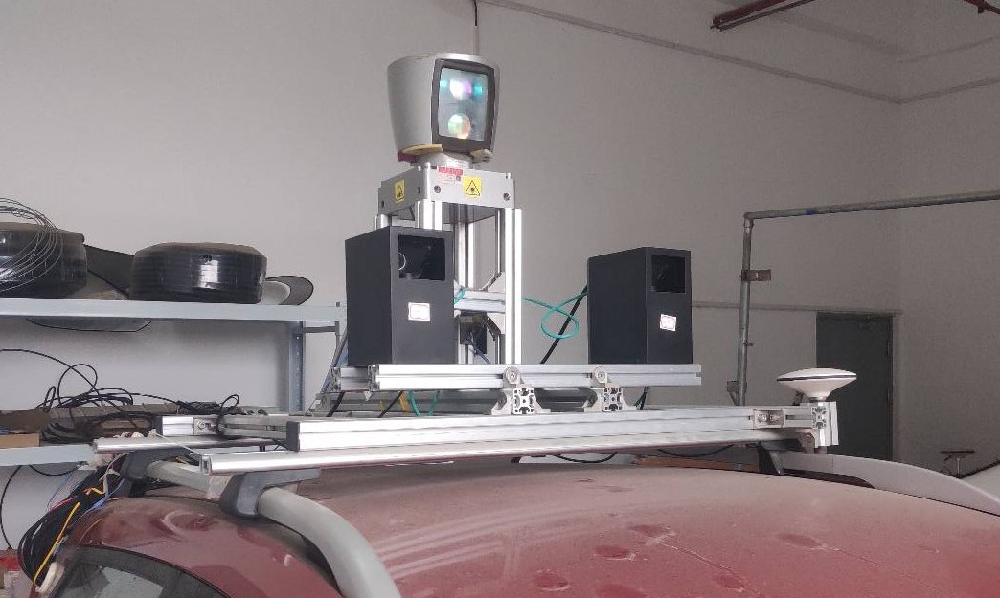

# VIS-TIR Datasets
A visible-light and thermal-infrared images datasets for dual-spectrum depth estimation

You can download the dataset with [BaiduYun](https://pan.baidu.com/s/1nQt-e3wxJdfMEuafnE7cGQ?pwd=msdd)

If you are inconvenient to use BaiduYun, we will update a download link for Onedrive later.

## Hardware system for data collection
We use two hybrid [RGB-Thermal cameras](https://ieeexplore.ieee.org/document/8794320) which can output optical-aligned visible-light(VIS) and thermal-infrared(TIR) images to build a dual-spectrum stereo camera. A Velodyne-64E LiDAR sensor is used for 3D point cloud to get ground-truth.

The stereo baseline between left and right camera is 0.5m, and the camera focal length is 1.6345*10^3mm

## Data exapmle
For our dual-spectrum stereo camera, each data frame
contains six images: left/right VIS images, left/right TIR image,
and left/right depth map ground-truth.

Datasets contains images with varing sences and illuminations.

